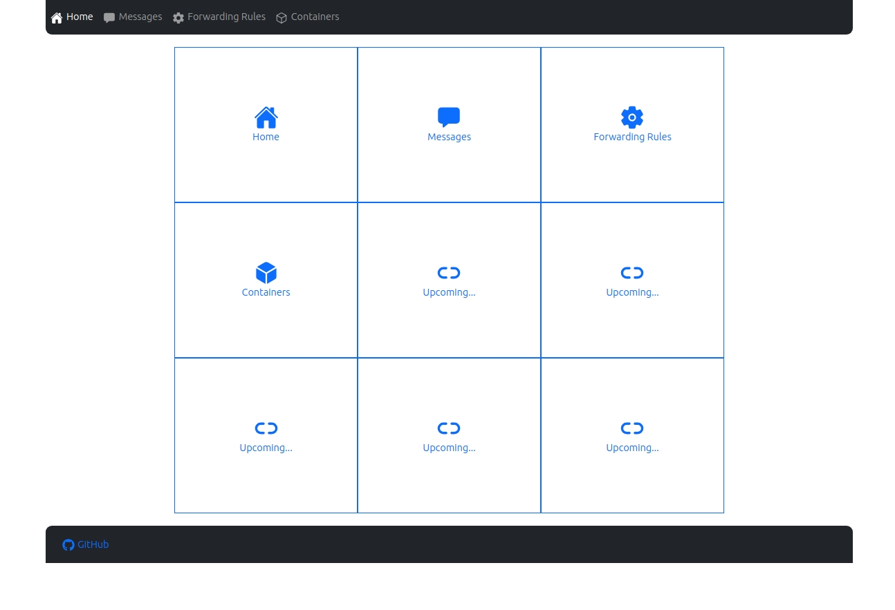
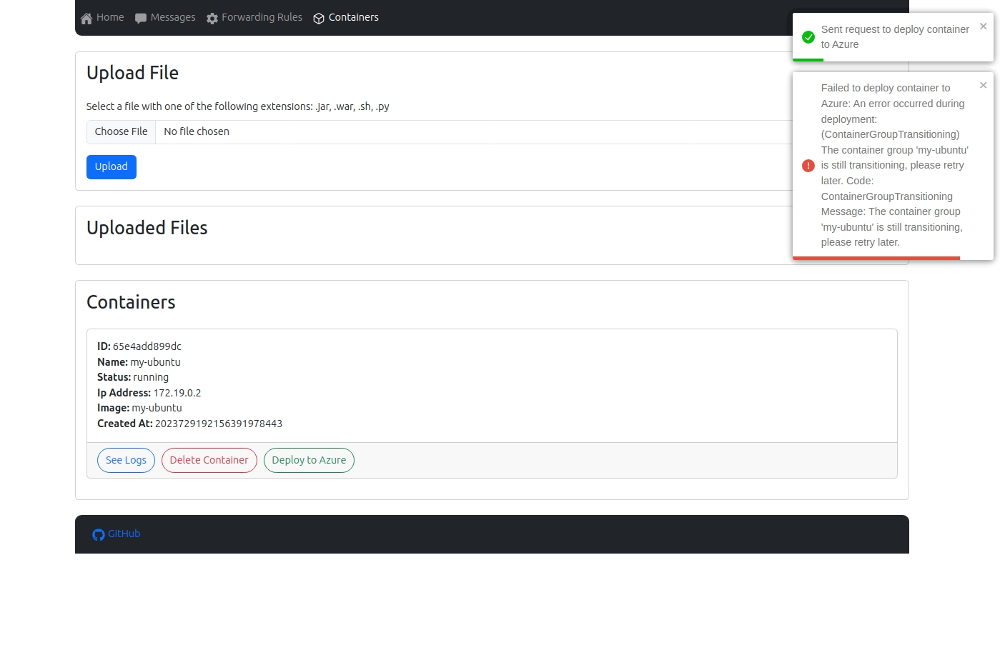
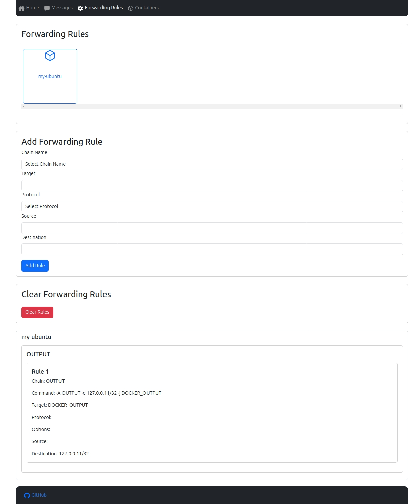
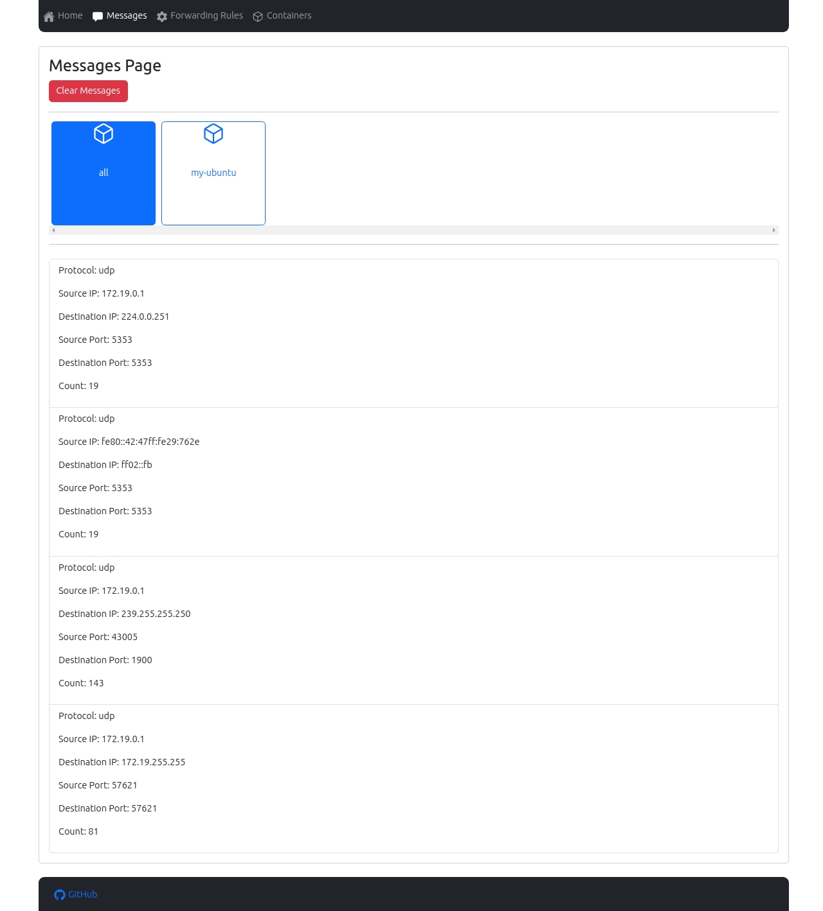
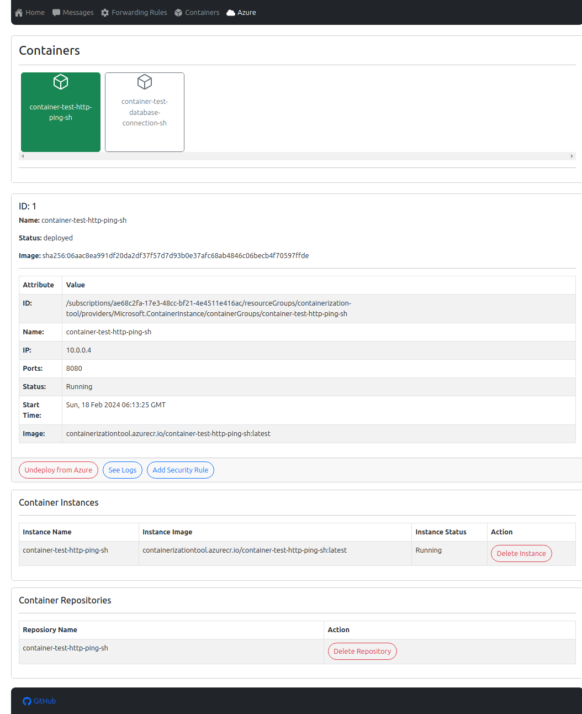

# Containerization Tool

## Table of Contents

- [Containerization Tool](#containerization-tool)
  - [Table of Contents](#table-of-contents)
  - [Description](#description)
  - [Documentation](#documentation)
  - [Start the Tool](#start-the-tool)
    - [Local Environment](#local-environment)
      - [Prerequisites](#prerequisites)
      - [Start-up scripts](#start-up-scripts)
      - [Start-up steps (Docker Compose)](#start-up-steps-docker-compose)
  - [Utils](#utils)
  - [Application Structure](#application-structure)
  - [Screenshots](#screenshots)

## Description

Because most of the issue of containerization of an application comes from networking mapping,
this tool is designed to help developers to install the application in a container and run it.

By monitoring the network traffic of the application, the tool will create reports of the incoming and outgoing traffic of the application.
The developer can see the report in an web interface and decide how to map the network traffic of the application.

## Documentation

- [Similar Tools](documentation/similar-tools.md)
- [Implementation](documentation/implementation.md)

## Start the Tool

### Local Environment

#### Prerequisites

> Following prerequisites are required to run the tool locally and were tested during development.

1. Os: _Ubuntu 23.04_

2. Docker:

```bash
❯ docker --version
Docker version 25.0.2, build 29cf629

❯ docker-compose --version
docker-compose version 1.29.2, build unknown
```

#### Start-up scripts

- start.sh:

  - starts docker-compose with the required containers (kafka, zookeeper, mysql, fluentd)
  - create the network for the containers deployed by the tool
  - create a first test container in that network

- generate_azure_creds.sh:
  - generate an azure service principal
  - user is prompted whether to replace the credentials in compose file

- clean.sh:
  - stop docker-compose
  - remove all the containers linked to tool network
  - remove the network
  - delete service principal

#### Start-up steps (Docker Compose)

1. Clone the repository

```bash
git clone https://github.com/vladtf/containerization-tool
```

2. Change directory to the repository

```bash
cd containerization-tool
```

3. Generate service principal for Azure

```bash
./generate_azure_creds.sh
```

4. Start the tool

```bash
./start.sh
```

## Utils

Directory [util](util) contains some useful scripts that can be used to see how some features of the tool work.

## Application Structure


## Screenshots

Home Page:



Containers Page:



Forwarding Rules Page:



Messages Page:



Azure Page:


